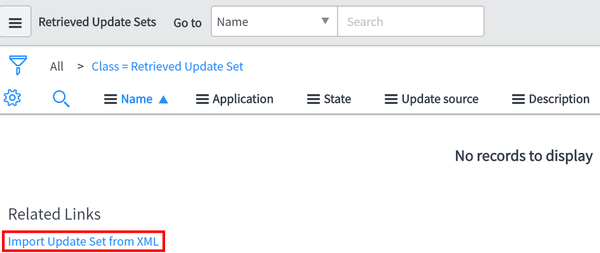
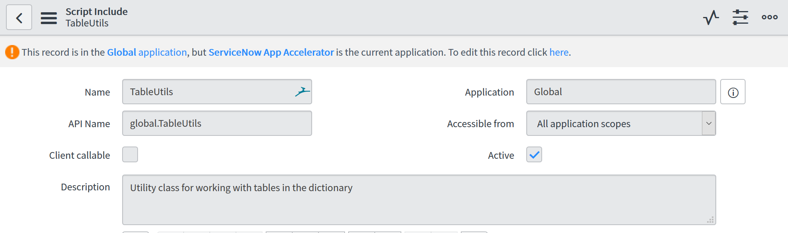

# ServiceNow App Accelerator API installation guide

This document guids you through the API installation process in ServiceNow. First off, download the following file to your preferred location:

* [Download Update Set](sys_remote_update_set_e10d82a4db020300a3b07d9ebf9619b4.xml)

Now go to your ServiceNow instance and navigate to `Update Sets > Retrieved Update Sets`. On that page, click on `Import Update Set from XML` as shown in the screenshot below.

On this page you can upload the [Update Set](sys_remote_update_set_e10d82a4db020300a3b07d9ebf9619b4.xml) and confirm by clicking on the `OK` button. After that you will get prompted to commit the Update Set to finally import it.

There are three private Script Includes, that need to be allowed for the ServiceNow App Accelerator application in order to work properly. Those are

* TableUtils
* TableDescriptor
* FieldDescriptor

Simply switch to `System Definition > Script Includes`, edit either one of these and change the `Accessible from` attribute to "All application scopes" as shown in the picture below.

Congratulations, you are set up!